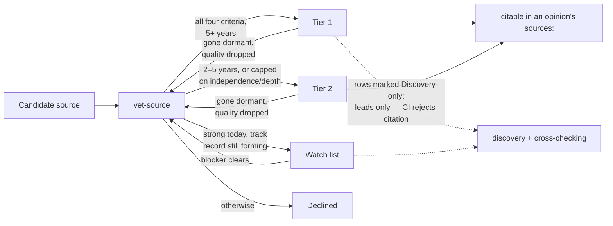
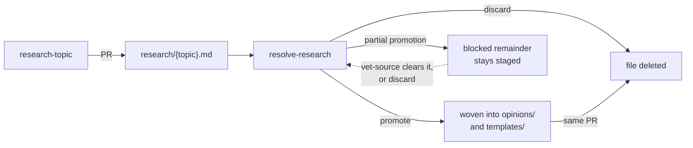

# dotnet-awesome-humans

Opinionated best practices for modern .NET.

Distils the published guidance of awesome humans: people and publications with a proven, multi-year track record, catalogued in [AWESOME-HUMANS.md](AWESOME-HUMANS.md). Aims to answer the question _"what does good look like in .NET right now?"_ and to keep answering it as .NET improves.

How to use this project:

- **Point an agent at it.** "Follow the conventions in <https://github.com/si618/dotnet-awesome-humans> when writing .NET code." The opinions cover conventions, project layout, language usage, and library choices.
- **Scaffold from it.** Copy files out of [`templates/`](templates), or run [`verify-project`](skills/verify-project/SKILL.md) against a codebase you already have.
- **Read it.** Every opinion starts with the recommendation, then the rationale, then the sources, with code examples where it makes sense.

## Scope

The main areas of modern .NET. The opinions live in [`opinions/`](opinions), one topic per file:

- **[Runtime & BCL](opinions/runtime-performance.md)** — performance idioms, `Span<T>`/memory, async, GC awareness
- **[Project structure & SDK](opinions/project-structure.md)** — project files, solution formats, central package management, analyzers, source generators
- **[C#](opinions/csharp.md)** — the latest released language version, and idiomatic use of what it added
- **[F#](opinions/fsharp.md)** — domain modelling, mixed C#/F# solutions, testing
- **[Application architecture](opinions/architecture.md)** — modular monolith, vertical slices, and when layering earns its keep
- **[ASP.NET Core](opinions/aspnet-core.md)** — minimal APIs, hosting, auth, OpenAPI, performance
- **[Data access](opinions/data-access.md)** — EF Core defaults, set-based work, when to drop to SQL
- **[Dates, times & time zones](opinions/datetime.md)** — type choice, UTC vs local storage, `TimeProvider`, testing time
- **[Globalisation & localisation](opinions/globalisation.md)** — culture vs ordinal, ICU and invariant mode, `IStringLocalizer`, and the data containers drop
- **[Logging & tracing](opinions/logging.md)** — structured logging, source-generated log messages, OpenTelemetry over OTLP
- **[UI frameworks](opinions/ui-frameworks.md)** — Blazor/WebAssembly, .NET MAUI, and cross-platform desktop (Avalonia)
- **[Testing](opinions/testing.md)** — framework choice, naming and structure, integration tests, coverage
- **[CI & automation](opinions/ci.md)** — pinned, reproducible builds and supply-chain hygiene
- **Libraries** — what to reach for and what to avoid, spread across the files above

A new opinion file must appear both here and in [Repository layout](#repository-layout) — CI fails the pull request otherwise.

## Freshness policy

Opinions target the latest released versions of .NET, C#, and F# — GA only, never an older LTS for comfort, with preview features confined to "Coming next" asides. New versions are folded in by the [skills](#maintenance-via-skills) below.

Every resource carries metadata recording when it was last reviewed, so staleness is visible rather than silent. `opinions/` and `templates/` files also record when each was last used as a reference; `research/` topics don't, because the only way to consult one is to build on it, which re-verifies it. An opinion's YAML frontmatter (a research topic carries the same block minus `last-used`):

```yaml
---
targets: [net10.0, csharp-14, fsharp-10]
last-reviewed: 2026-08-12
last-used: 2026-08-12
sources: [dotnet-blog, andrew-lock]
---
```

Template files carry the same fields in a first-line comment header instead — an XML or INI file cannot open with a `---` block and stay valid for MSBuild or the editors that read it (the two JSON templates have no comment syntax at all and are exempt):

```xml
<!-- dotnet-awesome-humans template | targets: net10.0 | last-reviewed: 2026-08-12 | last-used: 2026-08-12 | sources: ms-learn -->
```

## Awesome humans

Opinions have to be earned. Each one traces back to a vetted source — an individual (Stephen Toub, Andrew Lock) or a publication (the .NET Blog, Microsoft Learn) — admitted on track record: five years of sustained publishing for Tier 1, two to five for Tier 2, plus depth, accuracy, and independence of signal. The roster and the full criteria are in [AWESOME-HUMANS.md](AWESOME-HUMANS.md).

How a source gets in, and what its tier lets it do (orientation only — the admission criteria in AWESOME-HUMANS.md and the [`vet-source`](skills/vet-source/SKILL.md) skill are canonical):



### House opinions

One human outranks the roster: the repository owner. Their preferences enter through [HOUSE-OPINIONS.md](HOUSE-OPINIONS.md) and the [`weave-house-opinion`](skills/weave-house-opinion/SKILL.md) skill, and are always marked in place, so a reader can tell community best practice from local convention. HOUSE-OPINIONS.md defines the marking literal and what wins when the two conflict. Other contributors propose opinions, sourced or experience-based, through the [pull request template](.github/PULL_REQUEST_TEMPLATE.md).

## Repository layout

```text
├── README.md                 ← you are here
├── AGENTS.md                 ← instructions for AI agents working in this repo
├── CLAUDE.md                 ← pointer to AGENTS.md
├── AWESOME-HUMANS.md         ← vetted sources and admission criteria
├── HOUSE-OPINIONS.md         ← the owner's own opinions: intake and audit trail
├── opinions/                 ← the opinions, one topic per file, code examples as needed
│   ├── architecture.md
│   ├── aspnet-core.md
│   ├── ci.md
│   ├── csharp.md
│   ├── data-access.md
│   ├── datetime.md
│   ├── fsharp.md
│   ├── globalisation.md
│   ├── logging.md
│   ├── project-structure.md
│   ├── runtime-performance.md
│   ├── testing.md
│   └── ui-frameworks.md
├── research/                 ← saved research topics (staging: promote or discard)
├── scripts/                  ← this repository's own CI checks, as .NET file-based apps
│   ├── CommentHeader.cs      ← shared helper, pulled in with #:include
│   ├── Frontmatter.cs        ← shared helper, pulled in with #:include
│   ├── Opinions.cs           ← shared helper, pulled in with #:include
│   ├── validate-metadata.cs
│   ├── validate-opinion-sources.cs
│   └── validate-readme-index.cs
├── templates/                ← copy-paste-ready example files
│   ├── .editorconfig
│   ├── Directory.Build.props
│   ├── Directory.Packages.props
│   ├── example.slnf
│   ├── example.slnx
│   ├── global.json
│   └── projects/             ← exemplar .csproj / .fsproj files
└── skills/                   ← maintenance skills (see below)
```

## Maintenance via skills

The repository maintains itself through agent skills following the [Agent Skills specification](https://agentskills.io/specification), so any compliant agent can run them. Each is a directory under [`skills/`](skills) with a `SKILL.md`.

They are built for a cost-aware split: cheaper worker agents fan out across the web searches and source sweeps, and the strongest available model acts as editor — the only one that writes to the opinions and templates.

| Skill                                                                | Purpose                                                                                        |
| -------------------------------------------------------------------- | ---------------------------------------------------------------------------------------------- |
| [`refresh-dotnet-versions`](skills/refresh-dotnet-versions/SKILL.md) | Detect new .NET / C# / F# releases and update all opinions and templates to target them        |
| [`harvest-sources`](skills/harvest-sources/SKILL.md)                 | Sweep the awesome-humans sources for new posts and fold notable guidance into the opinions     |
| [`vet-source`](skills/vet-source/SKILL.md)                           | Evaluate a candidate source against the track-record criteria and admit or decline             |
| [`audit-freshness`](skills/audit-freshness/SKILL.md)                 | Report resources whose `last-reviewed` date has drifted past tolerance                         |
| [`verify-project`](skills/verify-project/SKILL.md)                   | Check an external project against the template files and report deviations                     |
| [`weave-house-opinion`](skills/weave-house-opinion/SKILL.md)         | Weave a repository-owner opinion into the opinions and templates, visibly marked as House      |
| [`research-topic`](skills/research-topic/SKILL.md)                   | Research a .NET topic conversationally using the opinions and vetted sources — cited and saved |
| [`resolve-research`](skills/resolve-research/SKILL.md)               | Resolve a saved research topic — weave it into the opinions and templates, or discard it       |

### Research lifecycle

Research is staged, never merged in place: `research-topic` saves the evidence, `resolve-research` decides what becomes the opinion. Both outcomes end with the file deleted in the same pull request — a topic on disk is unresolved by definition, and deletion is the only promotion marker (orientation only — the two `SKILL.md` files are canonical):



### Release watch automation

A scheduled GitHub Action ([`.github/workflows/dotnet-release-watch.yml`](.github/workflows/dotnet-release-watch.yml)) polls the official [.NET releases index](https://github.com/dotnet/core/blob/main/release-notes/releases-index.json) daily against the checked-in snapshot at [`.github/state/dotnet-releases.json`](.github/state/dotnet-releases.json). A new GA release opens a pull request updating that snapshot. The PR is a trigger for running [`refresh-dotnet-versions`](skills/refresh-dotnet-versions/SKILL.md); it changes no opinion or template itself.

## Repository scripts

The checks that gate a pull request are written in the stack this repository has opinions about. [`scripts/`](scripts) holds them as .NET 10 file-based apps — no project file, no build step, dependencies declared inline with `#:package` and shared code pulled in with `#:include`.

| Script                                                               | Checks                                                                                                                                                                       |
| -------------------------------------------------------------------- | ---------------------------------------------------------------------------------------------------------------------------------------------------------------------------- |
| [`validate-metadata.cs`](scripts/validate-metadata.cs)               | Every resource under `opinions/`, `research/` and `templates/` carries `targets`, `last-reviewed` and `sources` — plus `last-used` outside `research/` — with ISO 8601 dates |
| [`validate-opinion-sources.cs`](scripts/validate-opinion-sources.cs) | Every source id resolves to the roster in AWESOME-HUMANS.md, and is allowed to feed an opinion                                                                               |
| [`validate-readme-index.cs`](scripts/validate-readme-index.cs)       | This README indexes every opinion and skill, in both directions                                                                                                              |

Run them from the repository root, exactly as CI does:

```sh
dotnet run scripts/validate-metadata.cs
```

[`Opinions.cs`](scripts/Opinions.cs) lists the opinion files, [`Frontmatter.cs`](scripts/Frontmatter.cs) parses the YAML frontmatter on `opinions/` and `research/` files, and [`CommentHeader.cs`](scripts/CommentHeader.cs) parses the first-line comment header that carries the same fields on `templates/` files (see [Freshness policy](#freshness-policy) for why templates use a comment instead). None of the three helpers runs alone: each declares no top-level statements, and compiles into whichever script `#:include`s it.

The SDK comes from [`global.json`](global.json), pinned to the feature band that understands `#:include` and kept in step with [`templates/global.json`](templates/global.json). One check is still Python — the Agent Skills spec validator, published only to PyPI.

## License

See [LICENSE](LICENSE).
